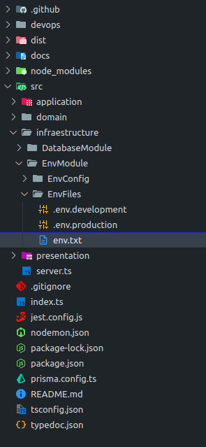
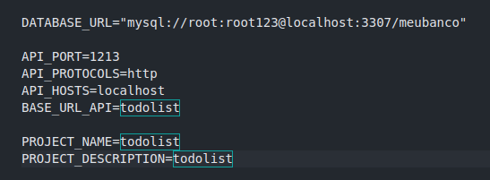
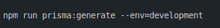
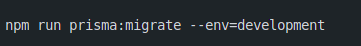
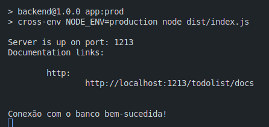
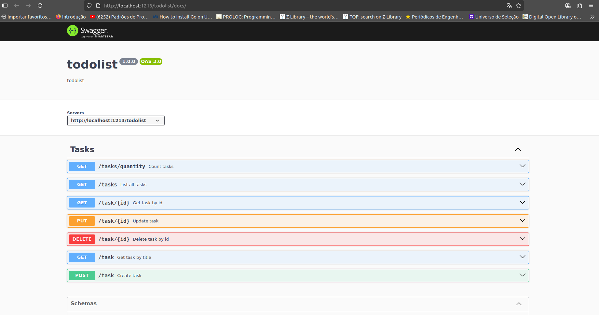
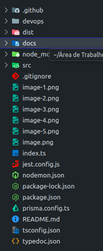
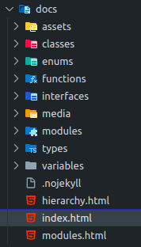
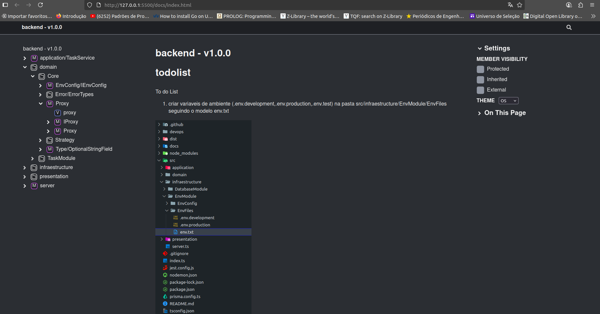

# todolist
To do List

1) criar variaveis de ambiente (.env.development,.env.production,.env.test) na pasta src/infraestructure/EnvModule/EnvFiles seguindo o modelo env.txt

(Sugere-se trocar, caso seja desejado, somente o endereço do banco - esse pedaço especificamente: 
root:root123@localhost:3307) -> user:password@host:port

2) Execute esse comando para levantar container mysql (só se achar necessário) npm run app:setupDatabaseContainer 
(No estiver no linux pode vir a calhar caso o primeiro comando dê erro: sudo env "PATH=$PATH" npm run app:setupDatabaseContainer -> isso levanta um container docker - necessário ter o docker na máquina, para facilitar demonstração, mas pode ser usado o seu banco de dados normalmente) 

3) execute o comando de acordo com o seu .env para projetar modelo dedos do ORM Prisma: 
npm run prisma:generate --env=development,production,test

4) execute o comando de acordo com o seu .env para sicronizar modelo dedos do ORM Prisma:
npm run prisma:migrate --env=development,production,test

5) execute para gerar build e documentação técnica do projeto:
npm run app:setup

6) execute npm run app:prod para excecutar a build:

Api documentada:

Documentação técnica:

