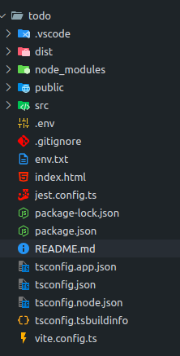
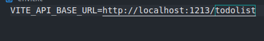
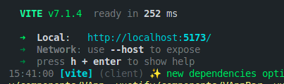
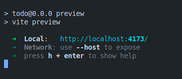
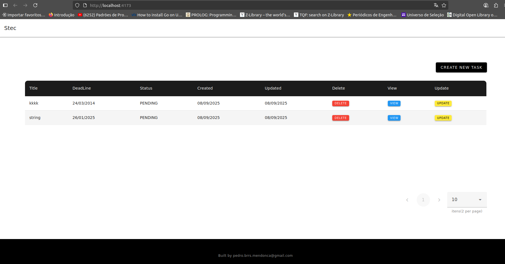
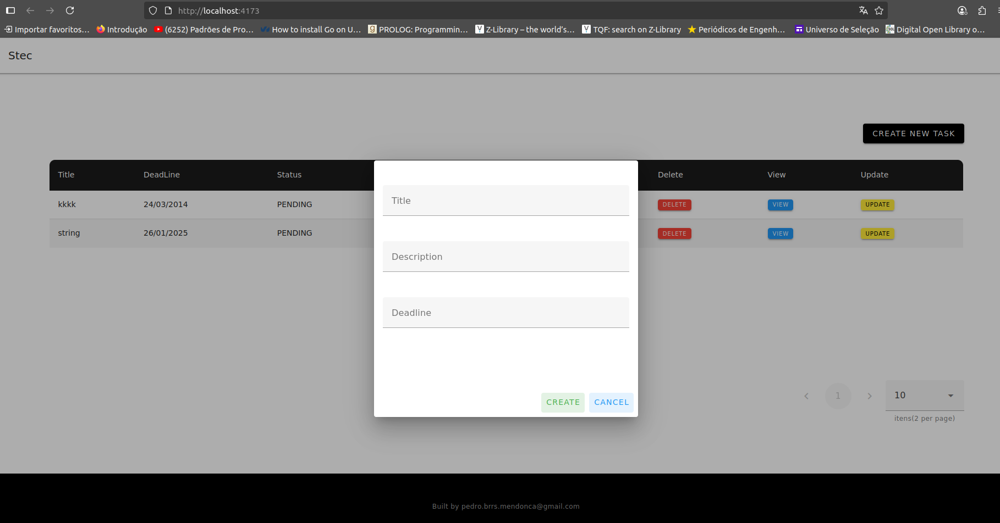
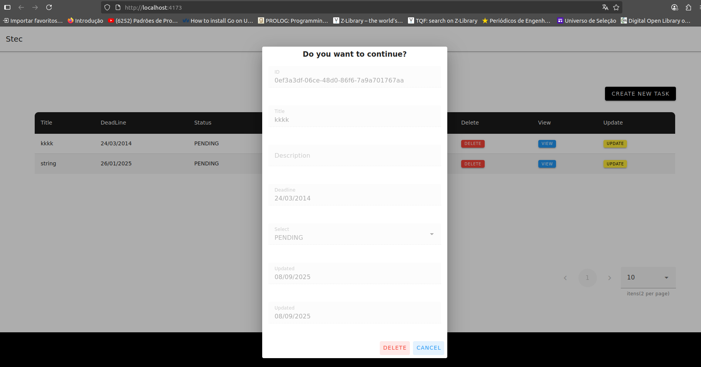
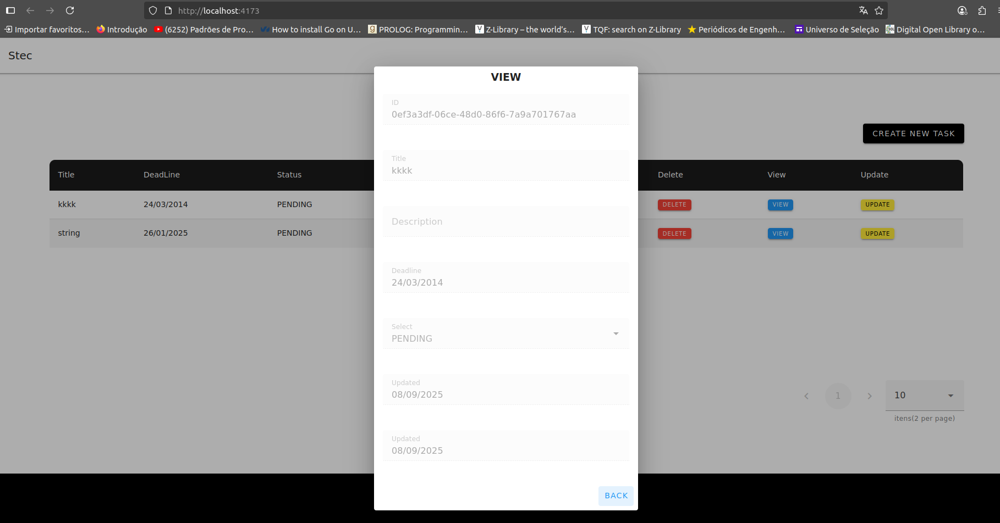
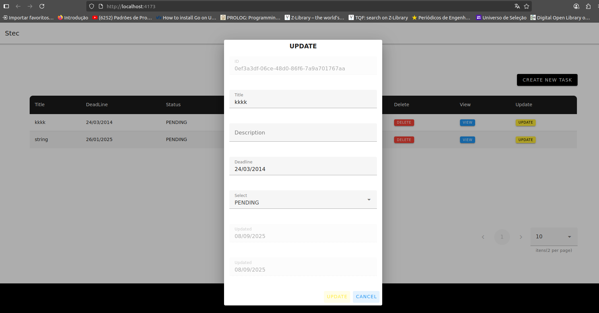

# Vue 3 + TypeScript + Vite + Todolist

1) Criar .env na raiz do projeto:
   

Obs.: O modelo está no env.txt

1) na raiz do projeto, execute: npm i --force

2) na raiz do projeto, execute esse comando se quiser abrir em desenvolvimento (Não recomendo): npm run dev

3) na raiz do projeto, execute esse comando se quiser fazer a build do projeto (Recomendado): npm run build

4) na raiz do projeto, execute esse comando para executar a build: npm run preview

5) Operações:
   
   

   

   

   

   

